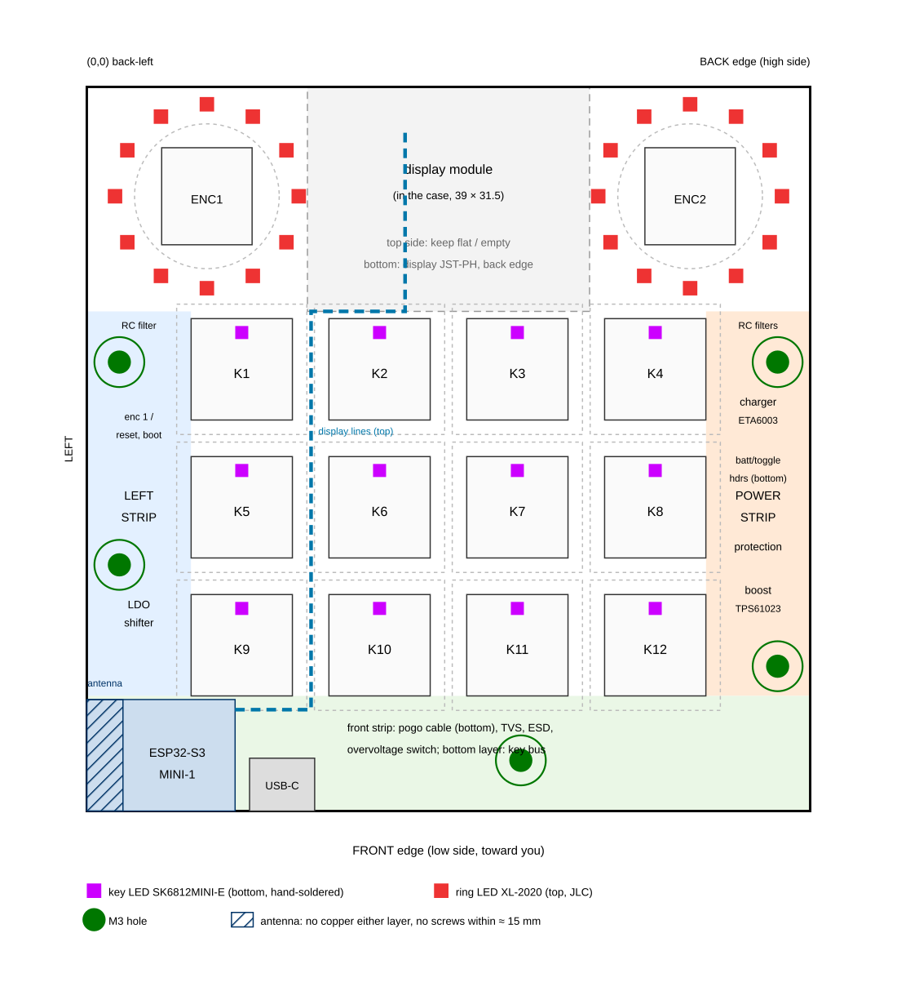

# Pad v2 — PCB Placement Guide

Where everything goes on the pad v2 main board and the shared pogo board. The parts were decided in `docs/pad-v2-*.md`; the wiring guide (PAD_CONNECTIONS) comes with the schematic. The v1 guide (`hardware/pad/PCB_PLACEMENT.md`) is the starting point: key grid, encoder footprint and LED chain order are kept.

Drawing (to scale): [docs/pad-v2-pcb-top.png](../../docs/pad-v2-pcb-top.png).

## Contents

1. [What changed from v1](#1-what-changed-from-v1)
2. [Coordinates, outline, holes](#2-coordinates-outline-holes)
3. [Keys, sockets and key LEDs](#3-keys-sockets-and-key-leds)
4. [Encoders and ring LEDs](#4-encoders-and-ring-leds)
5. [ESP32-S3-MINI-1 and the antenna](#5-esp32-s3-mini-1-and-the-antenna)
6. [Zones for everything else](#6-zones-for-everything-else)
7. [Connectors](#7-connectors)
8. [Sides, heights and who solders what](#8-sides-heights-and-who-solders-what)
9. [Case, battery and docking](#9-case-battery-and-docking)
10. [Pogo board (pad floor and dock lid)](#10-pogo-board-pad-floor-and-dock-lid)
11. [Net classes](#11-net-classes)
12. [Open points](#12-open-points)
13. [Routing plan (GPIO map)](#13-routing-plan-gpio-map)

## 1. What changed from v1

| | v1 | v2 |
|---|---|---|
| Board | 100 × 92 mm | **100 × 100 mm** (the extra 8 mm at the front hold the ESP32 module) |
| MCU | socketed Pico 2 WH under the key field, bottom side | **ESP32-S3-MINI-1 at the front-left corner, top side** (JLC) |
| Encoders, rings, display | shafts at y = 16.6 | **1.5 mm further back (y = 15.1)**, so the key rows move back with them and the front strip is 15.9 mm deep |
| Key rows | y = 40.50 / 59.55 / 78.60 | **y = 39.00 / 58.05 / 77.10** (columns unchanged) |
| Ring LEDs | SK6812MINI-E, bottom side, through holes | **XL-2020RGBC-WS2812B, top side** (JLC) |
| Power parts, expander | bottom side, hand-soldered | **top side, JLC**; no expander (direct GPIOs) |
| Bottom side | almost everything | **only hand-soldered parts:** hot-swap sockets, key LEDs, THT encoder/connector pins |
| Pogo | board in the back wall, 4-wire cable | **board in the floor** (pad sits on top of the dock), 7-wire cable |

The JLC parts all sit on the top side, so the order stays single-sided assembly (no second-side setup fee).

## 2. Coordinates, outline, holes

Coordinates are **mm from the board's back-left corner**, seen from the top (key side): x to the right, y towards the front. KiCad setup as in v1: draw the outline, **Place → Grid Origin** at its top-left corner, and set **Display origin: Grid origin, Y axis: increases down**.

- **Outline:** 100 × 100 mm, already drawn in `pad-v2.kicad_pcb` from page position (100, 50) to (200, 150), with the grid origin at (100, 50). With **Display origin: Grid origin** the board reads (0, 0) to (100, 100). GND pours on both layers are in place. Fits JLC's 100 × 100 tier.
- **Mounting holes:** M3, `MountingHole:MountingHole_3.2mm_M3`, with schematic symbols this time (so the parity check stays clean).

| Hole | X | Y | Note |
|---|---|---|---|
| H1 | 4.50 | 38.00 | left strip, top |
| H2 | 95.50 | 38.00 | right strip, top |
| H3 | 4.50 | 66.00 | ≥ 15 mm from the antenna |
| H4 | 95.50 | 80.00 | right strip, bottom |
| H5 | 60.00 | 93.00 | front strip, ≈ 40 mm from the antenna |

## 3. Keys, sockets and key LEDs

- 4 × 3 grid, **19.05 mm pitch**. Columns x = **21.42, 40.47, 59.52, 78.58**; rows y = **39.00, 58.05, 77.10**.
- Switch footprint: MX with Kailh hot-swap socket and the two plastic-peg holes, so **3-pin and 5-pin switches** both fit (your pick, open). Origin = switch centre, **orientation 180°**: LED window towards the back, socket towards the front (as v1).
- **Key LED** (SK6812MINI-E, reverse mount) **5.08 mm behind the switch centre**, **bottom side**, shining up through its cutout. Its 100 nF goes on the **top side** in the gap between key rows, with a via to the LED's VDD (JLC places it; no 0402 for you to hand-solder).

| Key | X | Y | LED Y (bottom) |
|---|---|---|---|
| 1–4 | 21.42 / 40.47 / 59.52 / 78.58 | 39.00 | 33.92 |
| 5–8 | same | 58.05 | 52.97 |
| 9–12 | same | 77.10 | 72.02 |

Before ordering: print the key area 1:1 and check a switch, a socket and the LED window direction.

## 4. Encoders and ring LEDs

- Encoder footprint `dock:RotaryEncoder_Bourns_PEC11R-4xxxF-S_Vertical`, top side, 0°. Origin is pin A; **footprint position = shaft − (7.5, 2.5)**.

| Encoder | Role | Shaft | Footprint position |
|---|---|---|---|
| ENC1 | volume (left) | (16.60, 15.10) | (9.10, 12.60) |
| ENC2 | mic/call (right) | (83.40, 15.10) | (75.90, 12.60) |

- **Ring LEDs:** 12 per encoder, **top side**, on a **12.7 mm radius** (just outside a 20 mm knob), one every 30°. Each LED's 100 nF sits just outside the ring. The light reaches the case top through 12 small holes or a light-pipe ring (case design).
- Clock positions: 12 = towards the back edge. Chain order: see below the table.

| Clock | Ring 1 X | Ring 1 Y | Ring 2 X | Ring 2 Y |
|---|---|---|---|---|
| 6 | 16.60 | 27.80 | 83.40 | 27.80 |
| 7 | 10.25 | 26.10 | 77.05 | 26.10 |
| 8 | 5.60 | 21.45 | 72.40 | 21.45 |
| 9 | 3.90 | 15.10 | 70.70 | 15.10 |
| 10 | 5.60 | 8.75 | 72.40 | 8.75 |
| 11 | 10.25 | 4.10 | 77.05 | 4.10 |
| 12 | 16.60 | 2.40 | 83.40 | 2.40 |
| 1 | 22.95 | 4.10 | 89.75 | 4.10 |
| 2 | 27.60 | 8.75 | 94.40 | 8.75 |
| 3 | 29.30 | 15.10 | 96.10 | 15.10 |
| 4 | 27.60 | 21.45 | 94.40 | 21.45 |
| 5 | 22.95 | 26.10 | 89.75 | 26.10 |

**LED chain (changed 2026-10-05, firmware index = reference − 401):** 0–3 keys 9, 10, 11, 12; 4–7 keys 8, 7, 6, 5; 8–11 keys 1, 2, 3, 4; 12–23 ring 2 counter-clockwise from 7 o'clock (7, 6, 5 … 9, 8); 24–35 ring 1 counter-clockwise from 4 o'clock (4, 3, 2 … 6, 5). The chain starts at key 9, next to the ESP32, so the level shifter U402 and R404 sit at the bottom of the left strip and the data line is short. One long hop: ring 2's 8 o'clock LED to ring 1's 4 o'clock LED (≈ 45 mm, under the display).

## 5. ESP32-S3-MINI-1 and the antenna

- Module **15.4 × 20.5 mm, top side**, lying along the front edge at the **front-left corner**: x 0–20.5, y 84.6–100, **antenna end at the left board edge** (x = 0). Key 9's switch body ends at y 84.1, so 0.5 mm clearance.
- **Antenna keep-out:** no copper on either layer under and around the antenna end (the module's datasheet layout guide gives the exact zone), no screws, magnets or battery within ≈ 15 mm. The case wall at the front-left must be plastic.
- **Footprint:** `pad_v2:ESP32-S3-MINI-1` (`hardware/libraries/pad_v2.pretty`). Pads are KiCad's `ESP32-S2-MINI-1` land pattern (identical; KiCad's own S3 symbol points to it), with the body outline, courtyard and antenna keep-out redrawn for the 20.5 mm S3 module (datasheet v1.7, fig. 11-1). The keep-out covers only the antenna area, because the module sits inside the board with the antenna at the edge. **Position (9.50, 92.30), rotation 90°** puts the body at x 0–20.5, y 84.6–100 with the antenna at the left edge.
- **BLE path:** the dock's ESP32-C3 sits a few centimetres below, so the link is short; the battery (steel can) is at the back, away from the antenna.
- Decoupling (10 µF + 100 nF) at the module's 3V3 pins; the 3.3 V LDO in the left strip just above it.

## 6. Zones for everything else

Zones are in the drawing. Exact positions are your call while routing; keep the groups.

| Zone | Where | Parts |
|---|---|---|
| **Left strip** | x 0–14.4, y 31–84 (top) | top: encoder 1 RC filter (upper end), RESET and BOOT buttons, **TLV75733P LDO** + caps and the **level shifter SN74AHCT1G125 + R404** (lower end, near the ESP and key 9) |
| **Power strip** | x 85.6–100, y 31–84 (top) | top, from the back: encoder 2 RC filter, **ETA6003 charger** (QFN-16) + 2.2 µH + input/SYS/BAT caps + ISET1/ISET2 resistors, **DW01A + FS8205A** (TSSOP-8) protection, **TPS61023 boost** + 1 µH (≥ 4.5 A) + caps + FB divider. Keep each switcher's loop tight (input cap, IC, inductor, output cap within a few mm), FB dividers away from the inductors. The 3 MHz charger and 1 MHz boost stay on this side, away from the antenna |
| **Front strip** | y 84.1–100, x 20.5–100 | **USB-C** at the front edge, centre x = 27 (right next to the module's USB pins) with its TPD4E1U06; **pogo input:** SMBJ15A TVS, TPD4E1U06, 1 k series resistors on TX/RX, **WS3222D overvoltage switch** (cuts off at 5.69 V) feeding the charger |
| **Back strip** | x 30.5–69.5, y 0–31 | under the display module: **top side flat or empty** (≤ 1.2 mm parts at most); bottom: display connector |
| **Key field** | between switches | only flat SMD parts in the 5 mm gaps between switch bodies: key-LED 100 nF caps, LED data vias |

## 7. Connectors

All hand-soldered THT, **bottom side**, side-entry (horizontal) unless noted, opening towards the nearest edge.

| Connector | Type | Where | Wires |
|---|---|---|---|
| Display | JST-PH 9-pin, `S9B-PH-K` side entry | back strip, back edge | BLK CS DC RES SDA SCL VCC GND + GND |
| Pogo cable | JST-XH 7-pin (same as the dock's J601) | front strip, bottom | 1:1 to the pad's pogo board in the floor |
| Battery | JST-XH 2-pin | power strip, right edge | B+, B− (to FS8205A); from the 21700 holder's leads |
| Toggle | JST-XH 3-pin | power strip, right edge | PERSONAL, COM (GND), WORK |
| USB-C | TYPE-C-31-M-12 (as the dock), **top side, JLC** | **front edge, centre x = 27** | flashing / debug only (VBUS not used). Moved from the left edge: the ESP32's USB pins face this way, and it is ≥ 20 mm from the antenna |
| NTC | JST-XH 2-pin | power strip, next to the battery header | 10 k B3950 thermistor taped to the cell (or a 10 k resistor if you skip it) |

## 8. Sides, heights and who solders what

- **Top side (JLC):** ESP32-S3 module, all power parts, ring LEDs, all 0402/0603 passives, USB-C, buttons. Inside the key field the plate is ≈ 3.5 mm above the board: only flat SMD between switches. Under the display: flat or empty.
- **Bottom side (you, soldering iron):** 12 Kailh hot-swap sockets, 12 SK6812MINI-E (≈ 300–330 °C, 2–3 s per leg, keep sealed until use), the connectors above.
- **Through-hole (you):** 2 PEC11R encoders (top), THT connector pins.

## 9. Case, battery and docking

- Wedge as in v1: **front ≈ 25 mm, back ≈ 44 mm**, slope ≈ 9–10°. The main board sits under the case top at the slope; encoder shafts and keys come through it; the display module is mounted to the case behind its window, cabled to the back strip.
- **Battery:** one 21700 in a holder fixed to the case floor at the back, lying left-right under the back strip (its two leads and the NTC pair run to the power strip). With one cell the back could become a little lower than 44 mm; that's settled in the 3D model.
- **Floor:** flat, sits on the dock lid. The pad's pogo board is in the floor (§10); its position must match the dock lid board in the 3D design, with the magnets of the pogo set holding the pad.
- **Toggle:** panel-mounted on the right side of the case, wired to the 3-pin header.
- **USB-C:** opening in the front case wall, left of centre.

## 10. Pogo board (pad floor and dock lid)

One small board design, used twice:

- **Parts:** the straight Motorobit 7-pin 2.54 mm magnetic pogo set half (spring pins on the pad's board, flat contacts on the dock's), a **JST-XH 7-pin** header, two M2/M2.5 mounting holes. No other parts: the ESD, TVS and series resistors stay on the main boards (dock: U601 at J601; pad: front strip).
- **Pin mapping:** contact n ↔ header pin n, cable 1:1 on both sides. Two identical boards facing each other meet contact 1 to contact 7, which gives the mirrored order:

| Contact / pin | Dock lid board (dock names) | Pad floor board (pad names) |
|---|---|---|
| 1 | GND | GND |
| 2 | +5V | +5V |
| 3 | DET | PAD_RX (from dock TX) |
| 4 | RX | PAD_TX (to dock RX) |
| 5 | TX | DET → tied to GND on the pad main board |
| 6 | +5V | +5V |
| 7 | GND | GND |

- Size ≈ 30 × 12 mm (set by the pogo part and the header); exact footprint once the straight set is in hand. Mark contact 1 on both silkscreens and on the case.

## 11. Net classes

| Class | Nets | Width |
|---|---|---|
| Battery | B+, B−, FS8205 path | ≥ 1.0 mm |
| Power | POGO_5V (pad input), VSYS, 5V_RGB, 3V3 | ≥ 0.6 mm (single-LED branches 0.3 mm) |
| Switch nodes | ETA6003 SW, TPS61023 SW | short and wide (≥ 1 mm), small copper area |
| USB | D+ / D− | 0.3 mm pair, short |
| Default | everything else | 0.2–0.25 mm |

GND: pour on both layers, stitched; keep it out of the antenna keep-out and the key-LED cutouts.

## 12. Open points

- Pogo footprint for the straight set (check against the part), Kailh socket + 5-pin MX footprint (v1's `dock:SW_MX_Hotswap_Kailh` plus peg holes).
- Back height of the case with one cell.

## 13. Routing plan (GPIO map)

The full pin map is in [PAD_WIRING.md](PAD_WIRING.md) §2. It was chosen so each signal leaves the module on the side facing its destination. The module's four pad rows, as placed (rotation 90°):

| Row | Module pins | Where it is | Signals | How they leave |
|---|---|---|---|---|
| **Front** | 1–15 (GND, 3V3, IO0–IO11) | y = 99.3, only 0.3 mm from the board edge | BOOT, keys 2, 6, 10, 3, 7, 11, 4, 8, 12, VBAT_SENSE, VIN_SENSE | no room outward: a via **under the module** next to each pad, then the **bottom layer** eastwards. The hot-swap sockets are on the bottom anyway, so the keys need no second via |
| **Right** | 16–30 | x = 19.05, faces the front strip | south part (IO12–IO18): toggle, charger status/enable, encoder 2. Middle: USB D−/D+ to the connector 4 mm away. North part: CHG_ISEL, RGB_EN, then four display lines | south part is boxed in by the USB pair and connector: vias, bottom layer, eastwards. North part: top layer |
| **Back** | 31–45 | y = 85.3, faces key 9 and the left strip | east end (IO35–37): three display lines. Then keys 9, 5, 1 (column 1, straight up the gap at x ≈ 13). West end: encoder 1, RGB data, EN | top layer; TXD0/RXD0 (pogo UART) drop to the bottom and run east under the module |
| Antenna side | 46–60 | all GND | | |

Bundles, in the order that avoids crossings:

- **Key bus (bottom layer):** leaves under the module's right row at y ≈ 86–91 (north of the USB pads), runs east along the front strip. Order north → south = IO1 … IO9 = keys 2, 6, 10, 3, 7, 11, 4, 8, 12. It peels off northwards: keys 2 and 6 up the gap between columns 1 and 2 (x ≈ 31.5), key 10 straight to its socket, keys 3 and 7 up the next gap (x ≈ 50.6), key 11, keys 4 and 8 (x ≈ 69.6), key 12. Each key's **signal pad is its west socket pad** (x = column − 5.84), the east pad is GND.
- **Right-strip bus (bottom layer, south of the key bus):** VBAT_SENSE, VIN_SENSE, then IO18 … IO12 = ENC2_A, ENC2_B, ENC2_SW, CHG_EN_N, CHG_STAT, TGL_PERSONAL, TGL_WORK. At the right strip it turns north: the encoder lines stay on the inside and continue to the top, the charger and toggle lines peel off to the east.
- **Display bundle (top layer):** seven lines gather at the module's north-east corner, run east along y ≈ 85, then north through the gap between key columns 1 and 2 (top layer is free there between the peg holes, x 27.4–34.5), to J501 at the back. Lanes west → east: BLK, CS, DC, RES, SDA, SCL, DISP_EN_N = J501 pins 1–6 and Q501. Place J501 with pin 1 on the left; if the footprint ends up mirrored, tell me and I mirror the six assignments (they are free to swap).
- **Left strip (top layer):** ENC1_A, ENC1_B, ENC1_SW up to the encoder; RGB_DATA to U402 at the bottom of the strip; EN to the RESET button.
- **3V3 to the module (pin 3, at the front edge):** via behind the module → bottom layer under it → via next to pin 3. C201/C202 sit just behind the module (the module has its own decoupling inside).
- **Top layer under the switches is free** except for each switch's five holes; the bottom layer there holds the sockets and LEDs.
